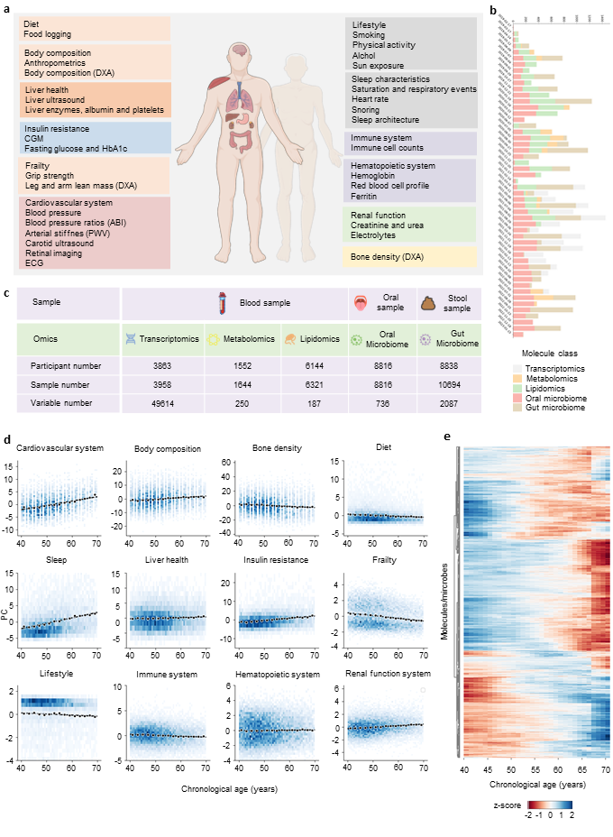

# PhenoAI-multi-omics biological age

Source code for the manuscript "Phenome-Wide Multi-Omics Integration Uncovers Distinct Archetypes of Human Aging"

Aging is a highly complex and heterogeneous process that progresses at different rates across individuals, making biological age (BA) a more accurate indicator of physiological decline than chronological age. While previous studies have built aging clocks using single-omics data, they often fail to capture the full molecular complexity of human aging. In this work, we leveraged the Human Phenotype Project\footnote{\url{https://knowledgebase.pheno.ai/}}, a large-scale cohort of 10,000 adults aged 40–70 years, with extensive longitudinal profiling that includes clinical, behavioral, environmental, and multi-omics datasets—spanning transcriptomics, lipidomics, metabolomics, and the microbiome. By employing advanced machine learning frameworks capable of modeling nonlinear biological dynamics, we developed and rigorously validated a multi-omics aging clock that robustly predicts diverse health outcomes and future disease risk. Unsupervised clustering of the integrated molecular profiles from multi-omics uncovered distinct biological subtypes of aging, revealing striking heterogeneity in aging trajectories and pinpointing pathway-specific alterations associated with different aging patterns. These findings demonstrate the power of multi-omics integration to decode the molecular landscape of aging and lay the groundwork for personalized healthspan monitoring and precision strategies to prevent age-related diseases.



```
@article{li2025phenome,
  title={Phenome-Wide Multi-Omics Integration Uncovers Distinct Archetypes of Human Aging},
  author={Li, Huifa and Tang, Feilong and Xue, Haochen and Li, Yulong and Zhuang, Xinlin and Zhang, Bin and Segal, Eran and Razzak, Imran},
  journal={arXiv preprint arXiv:2510.12384},
  year={2025}
}
```
